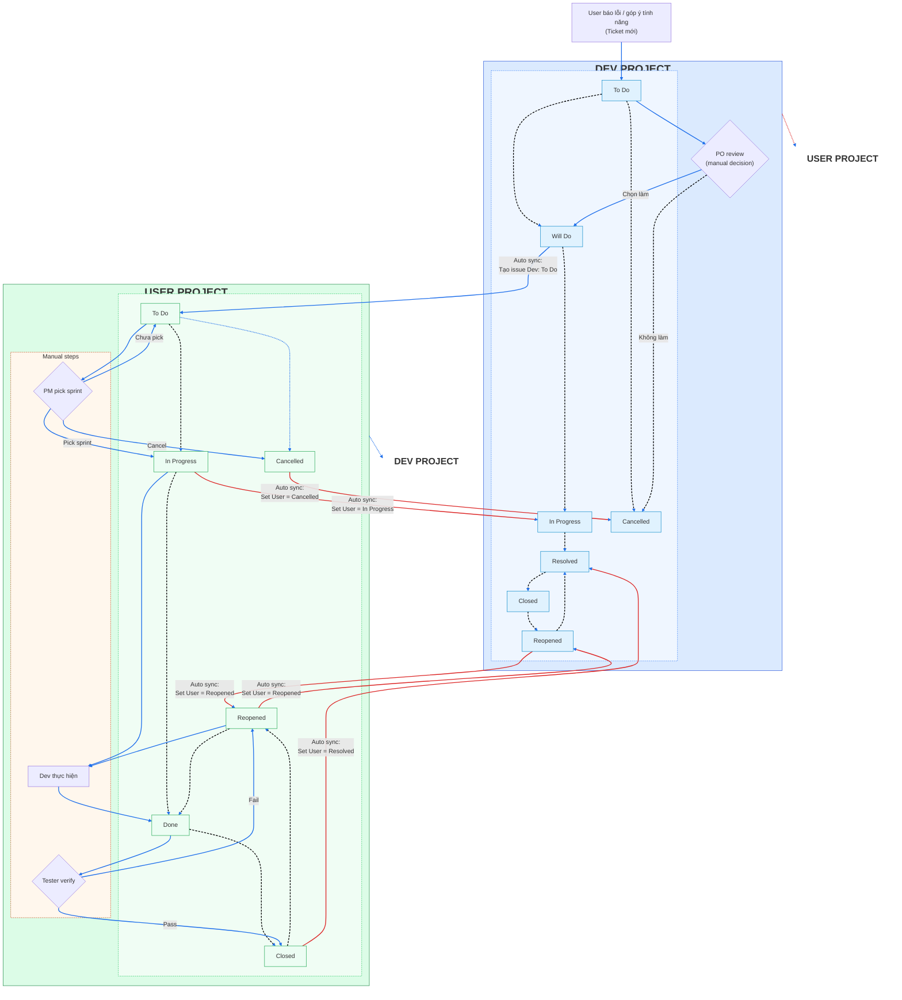

# Quy trình đồng bộ Jira

## Workflow trạng thái

## Bước khởi đầu & lộ trình tổng quát
- Nhận báo lỗi/góp ý từ user: tạo issue mới ở User Project, trạng thái khởi tạo `To Do` (Start → To Do trên sơ đồ).
- PO review `To Do` (hình thoi): chọn `Will Do` nếu làm, hoặc `Cancelled` nếu không làm.
- PM pick sprint (hình thoi) cho issue Dev: từ `To Do` sang `In Progress` nếu được đưa vào sprint; nếu scope đổi có thể chuyển `Cancelled`.
- Dev thực hiện: làm việc ở `In Progress`, xong chuyển `Resolved`.
- Tester verify (hình thoi): Pass → `Done`, Fail → `Reopened` (Dev xử lý lại trong nhóm Manual và chuyển về `Resolved`).
- Các mũi tên đứt thể hiện thứ tự xử lý chính giữa các trạng thái; mũi tên đặc màu xanh thể hiện sync tự động giữa hai project.

## Auto sync
- User ➜ Dev:
  - Khi User sang `Will Do`, hệ thống tự tạo issue Dev ở `To Do`.
- Dev ➜ User:
  - Dev sang `In Progress` → set User `In Progress`.
  - Dev sang `Resolved` → set User `Resolved`.
  - Dev sang `Cancelled` → set User `Cancelled`.
  - Dev sang `Reopened` → set User `Reopened`.
- Reopened: khi một bên `Reopened`, vòng sync tiếp theo sẽ phản chiếu sang bên còn lại, sau đó Dev làm lại và đẩy về `Resolved`.

## Diễn giải sơ đồ
- Nhóm User Project (xanh dương): nhận ticket, PO quyết định làm/không làm. Trạng thái nối đứt: To Do → Will Do → In Progress → Resolved → Closed → Reopened; nhánh Cancelled từ To Do.
- Nhóm Dev Project (xanh lá): issue được tạo tự động khi User `Will Do` và bắt đầu ở To Do. PM pick sprint → In Progress; Dev làm → Done → Closed; Tester verify (Fail → Reopened); có nhánh Cancelled từ To Do.
  - Khi Reopened, Dev xử lý lại thủ công và chuyển về `Resolved`.
- Auto sync (mũi tên xanh đặc): chuyển trạng thái giữa hai project đúng các mốc In Progress, Resolved, Closed (map sang User Resolved), Cancelled, Reopened; tạo issue Dev khi User Will Do.
- Màu sắc: box User nền xanh dương nhạt, box Dev nền xanh lá nhạt; nhóm và nhóm trạng thái có nền/viền riêng để tách bạch; các decision node (hình thoi) là bước thủ công.

## Vai trò & trách nhiệm
- **PO**
  - Tạo ticket User ở `To Do`.
  - Review và quyết định `Will Do` hoặc `Cancelled`.
- **PM**
  - Lên sprint, pick issue Dev từ `To Do` sang `In Progress`.
  - Có thể chuyển `Cancelled` nếu dừng scope.
- **Dev**
  - Làm ở `In Progress`, chuyển `Resolved` khi hoàn thành.
  - Nếu bị `Reopened` sau kiểm thử, xử lý lại và chuyển về `Resolved`.
- **Tester/QA**
  - Verify ở `Resolved`.
  - Pass → `Done`, Fail → `Reopened`.
- **Hệ thống tự động**
  - Tạo issue Dev khi User `Will Do`.
  - Đồng bộ trạng thái Dev → User cho các mốc `In Progress`, `Resolved`, `Cancelled`, `Reopened` để hai project luôn khớp nhau.
