# Quy trình đồng bộ Jira

## Workflow trạng thái

```mermaid
flowchart LR
    Start["User báo lỗi / góp ý tính năng<br/>(Ticket mới)"] --> U_TODO

    subgraph User_Project["USER PROJECT"]
        direction TB
        subgraph User_Statuses[" "]
            direction LR
            U_TODO["To Do"]
            U_WILLDO["Will Do"]
            U_INPROG["In Progress"]
            U_RESOLVED["Resolved"]
            U_DONE["Done"]
            U_REOPEN["Reopen"]
            U_CANCEL["Cancelled"]
        end
        %% Thứ tự chính (mũi tên đứt)
        U_TODO -.-> U_WILLDO -.-> U_INPROG -.-> U_RESOLVED -.-> U_DONE
        U_DONE -.-> U_REOPEN
        U_TODO -.-> U_CANCEL

        %% Quyết định thủ công của PO (dùng hình thoi)
        PO_REVIEW{"PO review<br/>(manual decision)"}
        U_TODO --> PO_REVIEW
        PO_REVIEW -->|Chọn làm| U_WILLDO
        PO_REVIEW -->|Không làm| U_CANCEL
    end

    subgraph Dev_Project["DEV PROJECT"]
        direction TB
        subgraph Dev_Statuses[" "]
            direction LR
            D_TODO["To Do"]
            D_INPROG["In Progress"]
            D_RESOLVED["Resolved"]
            D_DONE["Done"]
            D_REOPEN["Reopen"]
            D_CANCEL["Cancelled"]
        end
        %% Thứ tự chính (mũi tên đứt)
        D_TODO -.-> D_INPROG -.-> D_RESOLVED -.-> D_DONE
        D_DONE -.-> D_REOPEN
        D_TODO -.-> D_CANCEL

        %% PM chọn task cho sprint (manual decision)
        PM_PICK{"PM pick sprint<br/>(manual)"}
        D_TODO --> PM_PICK
        PM_PICK -->|Pick sprint| D_INPROG
        PM_PICK -->|Chưa pick| D_TODO
        PM_PICK -->|Cancel| D_CANCEL

        %% Dev thực hiện và hoàn thành (manual)
        D_INPROG -- "Dev thực hiện\n(manual)" --> D_RESOLVED

        %% Tester verify (manual, decision)
        TEST_VERIFY{"Tester verify<br/>(manual)"}
        D_RESOLVED --> TEST_VERIFY
        TEST_VERIFY -->|Pass| D_DONE
        TEST_VERIFY -->|Fail| D_REOPEN
    end

    %% Auto Sync (service) nối thẳng giữa hai project
    U_WILLDO -- "Auto sync:<br/>Tạo issue Dev: To Do" --> D_TODO
    D_INPROG -- "Auto sync:<br/>Set User = In Progress" --> U_INPROG
    D_RESOLVED -- "Auto sync:<br/>Set User = Resolved" --> U_RESOLVED
    D_DONE -- "Auto sync:<br/>Set User = Done" --> U_DONE
    D_CANCEL -- "Auto sync:<br/>Set User = Cancelled" --> U_CANCEL
    D_REOPEN -- "Auto sync:<br/>Set User = Reopen" --> U_REOPEN

    %% Màu nền để phân biệt hai project (palette mới)
    classDef userNode fill:#e0f2fe,stroke:#0284c7,stroke-width:1;
    classDef devNode fill:#ecfdf3,stroke:#16a34a,stroke-width:1;
    classDef userGroup fill:#dbeafe,stroke:#1d4ed8,stroke-width:1,font-size:28px,font-weight:bold;
    classDef devGroup fill:#dcfce7,stroke:#15803d,stroke-width:1,font-size:28px,font-weight:bold;
    classDef userStatusGroup fill:#eff6ff,stroke:#3b82f6,stroke-width:1,stroke-dasharray:3 2;
    classDef devStatusGroup fill:#f0fdf4,stroke:#22c55e,stroke-width:1,stroke-dasharray:3 2;
    class U_TODO,U_WILLDO,U_INPROG,U_RESOLVED,U_DONE,U_REOPEN,U_CANCEL userNode;
    class D_TODO,D_INPROG,D_RESOLVED,D_DONE,D_REOPEN,D_CANCEL devNode;
    class User_Project userGroup;
    class Dev_Project devGroup;
    class User_Statuses userStatusGroup;
    class Dev_Statuses devStatusGroup;

    %% Style: mũi tên đậm và màu xanh, riêng mũi tên đứt màu đen
    linkStyle default stroke:#1f6feb,stroke-width:2;
    linkStyle 1,2,3,4,5,6 stroke:#000,stroke-width:2,stroke-dasharray:5 3;
    linkStyle 10,11,12,13,14 stroke:#000,stroke-width:2,stroke-dasharray:5 3;
```

## Bước khởi đầu & lộ trình tổng quát
- Nhận báo lỗi/góp ý từ user: tạo issue mới ở User Project, trạng thái khởi tạo `To Do` (Start → To Do trên sơ đồ).
- PO review `To Do` (hình thoi): chọn `Will Do` nếu làm, hoặc `Cancelled` nếu không làm.
- PM pick sprint (hình thoi) cho issue Dev: từ `To Do` sang `In Progress` nếu được đưa vào sprint; nếu scope đổi có thể chuyển `Cancelled`.
- Dev thực hiện (manual): làm việc ở `In Progress`, xong chuyển `Resolved`.
- Tester verify (hình thoi): Pass → `Done`, Fail → `Reopen` (Dev quay lại `In Progress`).
- Các mũi tên đứt thể hiện thứ tự xử lý chính giữa các trạng thái; mũi tên đặc màu xanh thể hiện sync tự động giữa hai project.

## Auto sync
- User ➜ Dev:
  - Khi User ở `Will Do`, hệ thống tự tạo issue Dev ở trạng thái `To Do`.
- Dev ➜ User:
  - Dev `In Progress` → User `In Progress`.
  - Dev `Resolved` → User `Resolved`.
  - Dev `Done` → User `Done`.
  - Dev `Cancelled` → User `Cancelled`.
  - Dev `Reopen` → User `Reopen`.
- Reopen: khi một bên Reopen, vòng sync kế tiếp sẽ đẩy trạng thái tương ứng sang bên còn lại.

## Diễn giải sơ đồ
- Nhóm User Project (xanh dương): nhận ticket, PO quyết định làm/không làm. Trạng thái nối đứt: To Do → Will Do → In Progress → Resolved → Done → Reopen; nhánh Cancelled từ To Do.
- Nhóm Dev Project (xanh lá): issue được tạo tự động khi User `Will Do` và bắt đầu ở To Do. PM pick sprint → In Progress; Dev làm → Resolved; Tester verify (Pass → Done, Fail → Reopen); có nhánh Cancelled từ To Do.
- Auto sync (mũi tên xanh đặc): chuyển trạng thái giữa hai project đúng các mốc In Progress, Resolved, Done, Cancelled, Reopen; tạo issue Dev khi User Will Do.
- Màu sắc: box User nền xanh dương nhạt, box Dev nền xanh lá nhạt; nhóm và nhóm trạng thái có nền/viền riêng để tách bạch; các decision node (hình thoi) là bước thủ công.

## Vai trò & trách nhiệm
- **PO**
  - Tạo ticket User ở `To Do`.
  - Review và quyết định `Will Do` hoặc `Cancelled`.
- **PM**
  - Lên sprint, pick issue Dev từ `To Do` sang `In Progress`.
  - Có thể chuyển `Cancelled` nếu dừng scope.
- **Dev**
  - Làm ở `In Progress`, chuyển `Resolved` khi hoàn thành.
  - Nếu bị `Reopen` sau kiểm thử, quay lại `In Progress`.
- **Tester/QA**
  - Verify ở `Resolved`.
  - Pass → `Done`, Fail → `Reopen`.
  - Khi `Done`, User sẽ được mirror `Done`.
- **Hệ thống tự động**
  - Tạo issue Dev khi User `Will Do`.
  - Đồng bộ trạng thái Dev → User cho các mốc `In Progress`, `Resolved`, `Done`, `Cancelled`, `Reopen` để hai project luôn khớp nhau.
